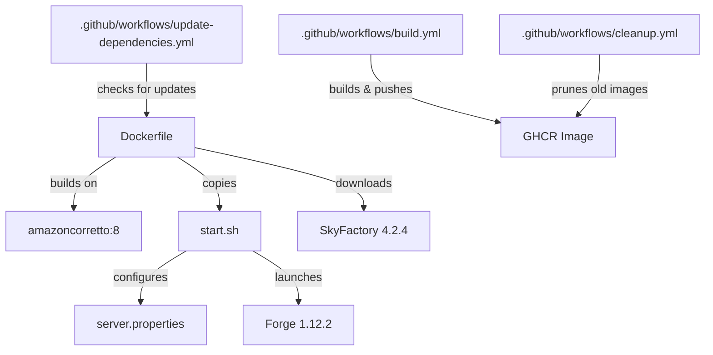

# Contributing

Thanks for your interest in contributing!

## Development Setup

### Prerequisites

- [Docker](https://www.docker.com/) (for building and testing the image)
- [pre-commit](https://pre-commit.com/) (for code quality checks)

### Getting Started

1. Clone the repository:

   ```bash
   git clone https://github.com/SimplicityGuy/docker-minecraft-skyfactory4.git
   cd docker-minecraft-skyfactory4
   ```

1. Install pre-commit hooks:

   ```bash
   pre-commit install
   ```

1. Build the image locally:

   ```bash
   docker build -t minecraft-skyfactory4:local .
   ```

### Pre-commit Hooks

This project uses [pre-commit](https://pre-commit.com/) to enforce code quality. The following hooks run automatically on each commit:

| Hook                              | Purpose                                   |
| --------------------------------- | ----------------------------------------- |
| `check-added-large-files`         | Prevents large files from being committed |
| `check-executables-have-shebangs` | Ensures scripts have proper shebangs      |
| `check-merge-conflict`            | Detects unresolved merge conflict markers |
| `check-yaml`                      | Validates YAML syntax                     |
| `detect-aws-credentials`          | Prevents accidental credential commits    |
| `detect-private-key`              | Prevents private key commits              |
| `end-of-file-fixer`               | Ensures files end with a newline          |
| `trailing-whitespace`             | Removes trailing whitespace               |
| `check-github-workflows`          | Validates GitHub Actions workflow files   |
| `mdformat`                        | Formats Markdown files (with GFM support) |
| `hadolint`                        | Lints the Dockerfile                      |

### Project Structure



### Security

All GitHub Actions are pinned to specific commit SHAs rather than mutable tags to prevent supply-chain attacks. When updating an action, always use the full commit SHA with a version comment:

```yaml
# Good
uses: actions/checkout@de0fac2e4500dabe0009e67214ff5f5447ce83dd # v6.0.2

# Bad - mutable tag can be overwritten
uses: actions/checkout@v4
```
