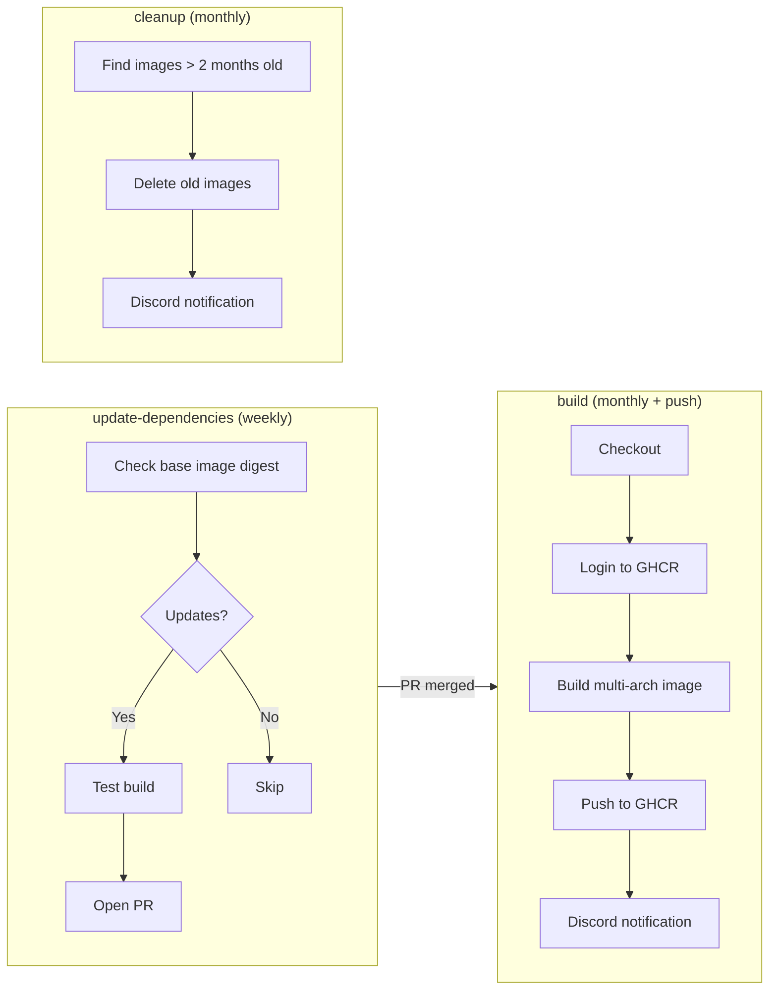

# Modern docker-based SkyFactory 4 Minecraft server

  [](https://github.com/pre-commit/pre-commit)

You're probably thinking to yourself, "Oh great, ANOTHER SkyFactory 4 Minecraft Docker image!" Well, you're not
wrong. However, there's good reason why this image was built.

Searching Docker Hub for a SkyFactory 4 Minecraft server can be daunting. There are many already out there. However,
all of these haven't been kept up-to-date. The most recent ones were built sometime in 2022 and many others haven't
been built since 2019 or 2020. A lot of things have changed since 2019. We all lived through the COVID-19 pandemic
and on the security front hackers have relentlessly been at it. Docker images built so long ago are bound to contain
security issues. Container-level security fixes need to be kept up-to-date on a regular basis. Additionally, some of
the pre-existing images were built using a base container that no longer exists (thanks Oracle!). So even if you
wanted to rebuild those images without any other changes, you can't.

The aim of this image is to address these issues. Most importantly, this image is based on the well-maintained Java 8
implementation by Amazon called Amazon Corretto. Say what you want about Amazon, but there's a team of engineers there
working on Corretto and making sure that it's well maintained. And there are [published Docker images](https://hub.docker.com/_/amazoncorretto)!

This image will also be built regularly, probably monthly, so that the latest patches from the Amazon Corretto base
image can be pulled in. It doesn't look like SkyFactory 4 has had any updates since December 2021. But if a newer
version is released, know that this image will be updated to use it, and tagged appropriately so you can choose whether
you want to use it or not.

This image wouldn't have been possible without the work of others, namely:

- [TrueOsiris/docker-minecraft-skyfactory4](https://github.com/TrueOsiris/docker-minecraft-skyfactory4)
- [jaysonsantos/docker-minecraft-ftb-skyfactory3](https://github.com/jaysonsantos/docker-minecraft-ftb-skyfactory3)

Thank you! 🙏🏻

Also, a major shout-out to [Geoff](https://github.com/itzg) who maintains perhaps the most popular dockerized Minecraft
server out there, [itzg/minecraft-server](https://github.com/itzg/docker-minecraft-server). Thank you a million times
over!! 🙌🏼

## Usage

To use the latest stable version, run:

```bash
docker run -dit -p 25565:25565 -e EULA=TRUE -v <path to where you want to store data>:/data --name mcs-sf ghcr.io/simplicityguy/minecraft-skyfactory4
```

Note the `EULA=TRUE` parameter. This assumes that you as the end-user have read and agreed to the EULA. I do not take responsibility
for you agreeing to them if in fact you don't.

The `server.properties` file will be generated at first launch. You may modify this file with your own settings, but if you
do so, you must `docker restart mcs-sf`. [This](https://pingperfect.com/index.php/knowledgebase/937/Minecraft--How-to-Change-SkyFactory-4andsharp039s-Level-Type.html) is a good reference on the `server.properties` in case you need pointers on configuring your server.

It's a good idea to view the logs of the running container to get an idea of whether the server started correctly or not. To
do so, use `docker logs -f mcs-sf`.

### Environment Variables

| Variable             | Default                             | Description                                                                        |
| -------------------- | ----------------------------------- | ---------------------------------------------------------------------------------- |
| `EULA`               | `FALSE`                             | Set to `TRUE` to accept the [Minecraft EULA](https://www.minecraft.net/en-us/eula) |
| `MOTD`               | `SkyFactory 4.2.4 Minecraft Server` | Message of the day shown in the server browser                                     |
| `LEVEL_NAME`         | _(empty)_                           | Name of the world/level                                                            |
| `LEVEL_TYPE`         | `DEFAULT`                           | World generation type                                                              |
| `GENERATOR_SETTINGS` | _(empty)_                           | Custom world generator settings                                                    |
| `JVM_OPTS`           | `-Xms4048m -Xmx4048m`               | Java VM options (adjust for your machine's available RAM)                          |

### Docker Compose

For a more persistent setup, create a `docker-compose.yml`:

```yaml
services:
  minecraft:
    image: ghcr.io/simplicityguy/minecraft-skyfactory4:latest
    container_name: mcs-sf
    ports:
      - "25565:25565"
    environment:
      EULA: "TRUE"
      MOTD: "My SkyFactory 4 Server"
      JVM_OPTS: "-Xms4048m -Xmx4048m"
    volumes:
      - ./data:/data
    restart: unless-stopped
```

Then run:

```bash
docker compose up -d
```

## Architecture

The image is built on [Amazon Corretto 8](https://hub.docker.com/_/amazoncorretto) and includes
SkyFactory 4.2.4 with Forge 1.12.2. Multi-architecture builds support both `linux/amd64` and `linux/arm64`.

### CI/CD Pipeline

Three GitHub Actions workflows automate the image lifecycle:



- **build** — Runs on push to `main`, on PRs, and on the 1st of each month. Builds and pushes multi-arch images to GitHub Container Registry (GHCR).
- **update-dependencies** — Runs weekly on Mondays. Checks if the base Docker image has updates and opens a PR if so.
- **cleanup** — Runs on the 15th of each month. Removes container images older than two months, keeping at least 2 and the `latest` tag.

All GitHub Actions are pinned to specific commit SHAs for supply-chain security.

## Contributing

See [CONTRIBUTING.md](CONTRIBUTING.md) for development setup and guidelines.

## Issues?

I'll do my best to help, but I make no guarantees. Please feel free to reach out or file an issue.
